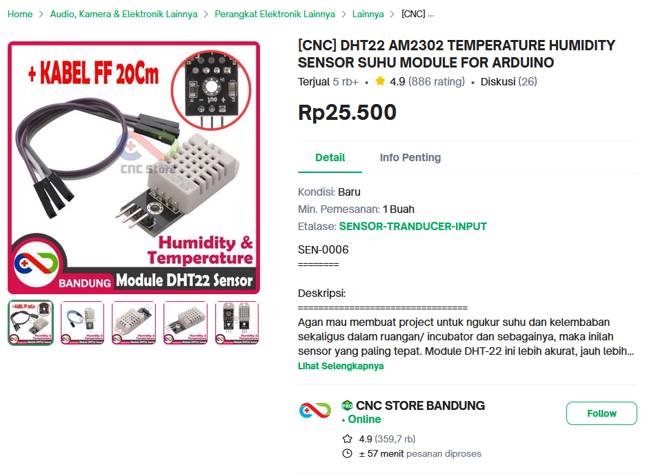
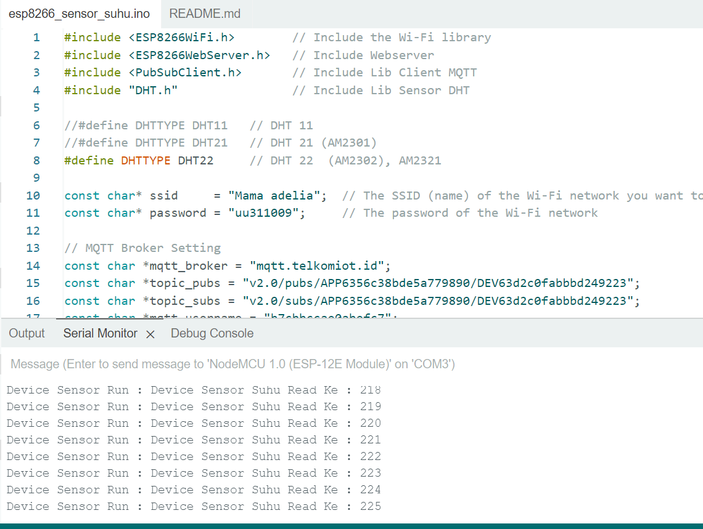
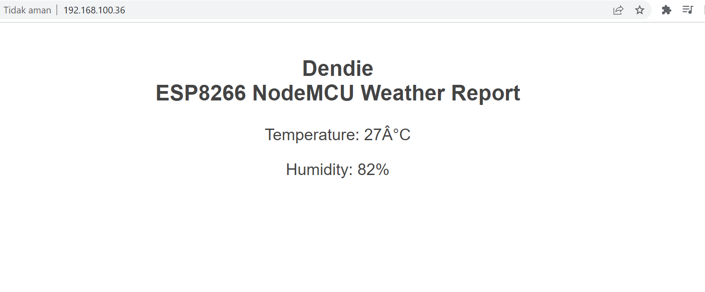

# IoT Arduion esp8266_dth22 and Monitoring Data Sensor via Web  

## Introducing

Creating sensor esp8266_dth22 device and monitoring data sensor via web, this program  write code arduion programming language to send sensor device data
through Wifi 

## Table of Contents
- [Introducing](#introducing)
- [Device Info](#device-info)
- [Simple Guide](#simple-guide)
  - [Device Sending Data to Telkom IoT Platform](#1-device-sending-data-to-telkom-iot-platform)
  - [Visualizing Data in Real-Time via Web](#2-visualizing-data-in-real-time-via-web)
- [Contact](#contact)
- [License](#license)

**esp8266**

ESP8266 is a very popular Wi-Fi module, which allows devices to connect to Wi-Fi networks and communicate over the internet. This module is often used in Internet of Things (IoT) projects because of its small size, affordable price, and ability to run its own code through an integrated microcontroller

**DHT22**

Sensor a temperature and humidity sensor known for its higher accuracy compared to the DHT11 (a simpler version).

This sensor can measure temperature in the range of -40 to +80 °C with an accuracy of around ±0.5°C, and humidity in the range of 0-100% RH with an accuracy of around ±2-5%.

## Device Info
Can be purchased at :

https://www.tokopedia.com/cncstorebandung/cnc-dht22-am2302-temperature-humidity-sensor-suhu-module-for-arduino

## Simple Guide

**1. This image to show device send data to Telkom IoT Platform**

**2. This image to show visuliasi data realtime get data from device via web**

## Contact

If you have questions, you can contact this email
Email: dendie.sanjaya@gmail.com

## License

This project is licensed under the MIT License.
